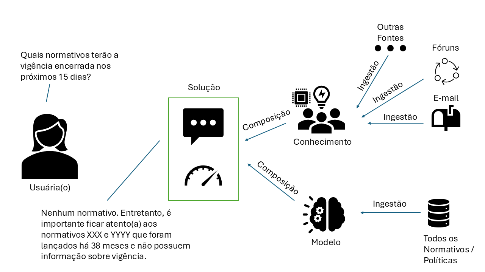
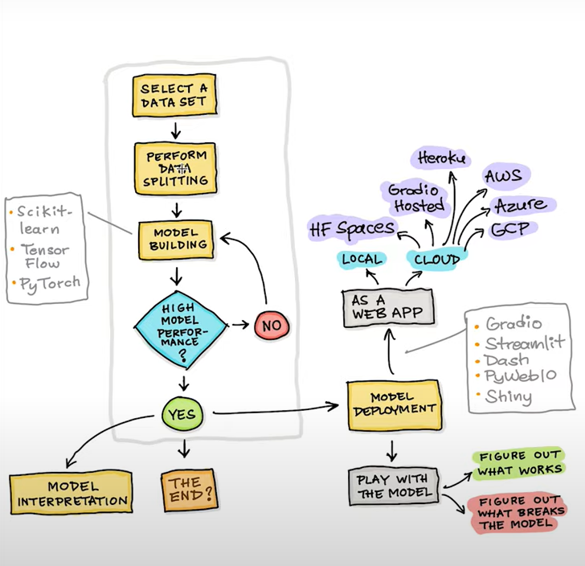
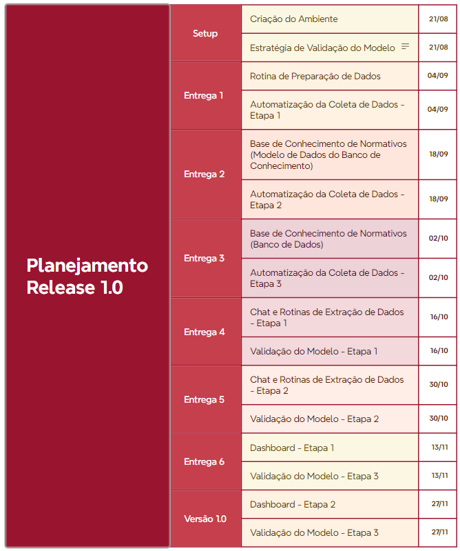

# goya
Goya é uma plataforma de inteligência artificial para apoiar a governança corporativa, colaborando com a curadoria de normativos, políticas e demais artefatos institucionais

Objetivo Geral: Construção de Software baseado em plataforma de Inteligência Artificial, em ambiente seguro, com capacidade para realizar atividades relacionadas à ingestão, avaliação, organização, classificação, consolidação e composição de normativos e políticas de governança corporativa, incluindo as de acesso restrito, através de uma interface com uso de linguagem natural e com capacidade de lidar com as especificidades da Empresa.  

## Objetivos Específicos:
1)	Composição de software capaz de utilizar capacidades de inteligência artificial, tais como interpretação de texto em linguagem natural, entendimento sobre o contexto dos normativos e políticas próprios da Empresa e composição de base de conhecimento com os relacionamentos entre os artefatos de forma coesa
2)	Estruturação de processo de preparação das fontes de dados, adequando a documentação de governança (normas/políticas) no formato adequado para tratamento
3)	Viabilizar a ingestão dos dados através do tratamento fontes de dados em formato de arquivo com capacidade de integrar em um ecossistema único toda a base de informações sobre políticas e normativos
4)	Alcançar a capacidade de organizar conteúdo no tempo, garantindo que a ordem de prevalência temporal seja obedecida em tempo de composição da base de informações
5)	Alcançar a capacidade de classificar a informação com base no conteúdo de maior afinidade, obedecendo a categorização de temas e suas relações hierárquicas
6)	Realizar a avaliação do conteúdo consolidado, aplicando a contextualização e composição textual da análise referente ao questionamento realizado pelo usuário
7)	Inserir a solução em um ambiente seguro, formado por infraestrutura computacional controlado pela Empresa, controlando o acesso de usuário e garantindo a segurança 

Atendendo aos objetivos específicos, espera-se que o produto possa responde as seguintes perguntas:

- Vigencia: Identificar a vigência dos normativos e ser possível de sinalizar quando deverá ser atualizado.
- Conflitos entre normativos: Identificar possíveis conflitos entre normativos, identificando pontualmente quais as correções necessárias ara remover inconsistências
- Atualização dos Normativos: Identificar 
- Contextualização: 

### Visão Macro

### Modelo

No intuito de dar encaminhamento à modelagem da solução, é necessário a composição/seleção de modelos adequados ao tratamento das informações específicas sobre o contexto da solução. A imagem a seguir consolida um fluxo geral de composição de modelos e seus principais frameworks

## Planejamento

No intuito de dar visibilidade ao andamento das atividades, segue proposta de cronograma para evolução da solução

